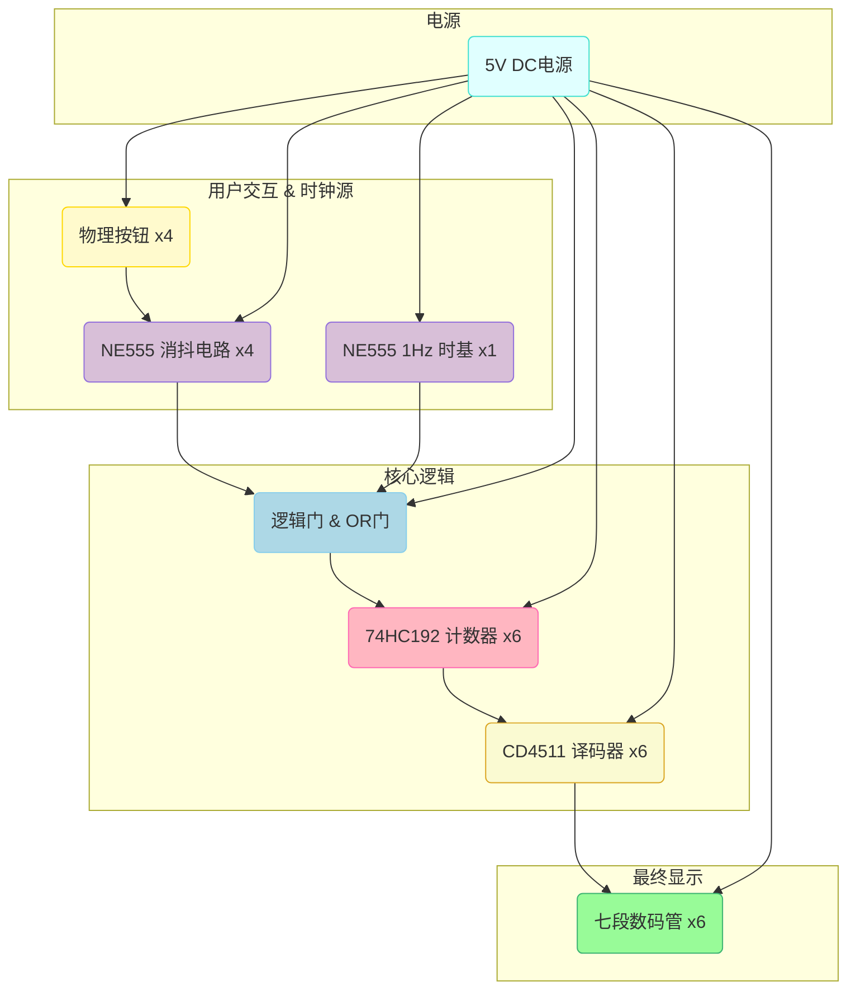

# 项目档案：NE 555“心动时刻”数字时钟

> **项目 ID:** Project_Heartbeat_Clock
> **创建日期:** 2025-10-15
> **标签:** #electronics #DIY #NE555 #digital_logic #gift_idea
> **目标:** 制作一份送给男朋友的、具有特殊意义的 DIY 礼物。

## 1. 项目概述

本项目旨在构建一个完全由**NE 555 定时器**和**标准逻辑 IC**驱动的六位七段数码管时钟。它不仅具备标准时钟的走时、校时、校分和归零功能，更加入了一个充满创意的“心动时刻”按钮——按下即可将时间瞬间定格在 **`05:20:00`**，赋予这件电子作品独一无二的浪漫意义。

这个项目是纯粹数字逻辑与模拟电路魅力的完美结合，是对经典电子技术的一次致敬，也是一份蕴含了时间和心意的特殊礼物。

## 2. 核心功能

- **[✓] 6 位时间显示:** `时:分:秒` (HH:MM:SS)
- **[✓] 1 Hz 时基:** 由 NE 555 搭建，可通过精密电位器手动校准。
- **[✓] 手动校时:** 独立的“校时”和“校分”按钮。
- **[✓] 秒针归零:** 独立的“复位”按钮，可将时间清零为 `00:00:00`。
- **[✓] 心动时刻:** 专属按钮，一键将时间设定为 `05:20:00`。
- **[✓] 按键消抖:** 所有交互按钮均由独立的 NE 555 电路进行消抖，确保操作精准。

## 3. 模块化设计详解

### 模块一：555 时基核心 (The Heart)

- **核心 IC:** `NE555` (第一颗)
- **工作模式:** 非稳态多谐振荡器
- **功能:** 产生整个时钟的“心跳”——一个频率约为 1 Hz 的方波信号。
- **关键设计:** 定时电阻网络由 `固定电阻 + 多圈精密电位器` 构成，这是后期微调时钟走时快慢、保证精准度的关键。

### 模块二：时间计数与译码链 (The Brain)

- **核心 IC:** `74HC192` (可预置 BCD 计数器) x 6, `CD4511` (BCD 转 7 段译码器) x 6
- **功能:** 负责时间的累加、进位和逻辑处理。
- **工作流程:**
    1.  **计数:** 6 片 `74HC192` 级联，1 Hz 信号驱动“秒个位”，并逐级进位。
    2.  **进制逻辑:** 通过与门等逻辑，实现秒/分十位的“六进制”和时十位的“三进制”计数。
    3.  **译码:** 每片 `74HC192` 的 BCD 码输出都连接到一片 `CD4511`，用于驱动数码管。
- **关键设计:** 选用 `74HC192` 的核心原因在于它具备**并行加载 (Parallel Load)**功能，这是实现“心动时刻”一键置数的秘密武器。

### 模块三：数码管显示系统 (The Face)

- **核心元件:** 七段数码管 x 6
- **功能:** 将电子信号可视化，显示时间。
- **注意事项:**
    1.  **匹配选型:** `CD4511` 用于驱动**共阴极**数码管。如果使用共阳极数码管，需换用 `74LS47` 等芯片。
    2.  **限流电阻:** **必须**在 `CD4511` 的 `a-g` 输出端与数码管的段选引脚之间，为**每一段**串联一个限流电阻 (推荐值 220Ω ~ 470Ω)，否则将永久损坏芯片或数码管。

### 模块四：555 交互控制中心 (The Controls)

- **核心 IC:** `NE555` (另外 4 颗), `74HC32` (四路或门)
- **功能:** 处理所有用户输入，并实现特殊功能。
- **工作流程:**
    1.  **按键消抖:** 4 个按钮（校时、校分、归零、心动时刻）分别连接一个工作在**单稳态模式**下的 `NE555`，将机械抖动转化为干净的单一脉冲。
    2.  **校时/校分:** 消抖后的脉冲通过 `74HC32` 或门，注入对应计数器 (`小时` / `分钟`) 的 `Count-Up` 引脚。
    3.  **归零:** 消抖后的脉冲连接到**所有**`74HC192` 的 `Master Reset` (MR) 引脚。
    4.  **心动时刻:** 这是最核心的设计。
        - 消抖后的脉冲 (低电平有效) 兵分两路：
        - **一路**连接到“秒”计数器的 `MR` 引脚，使秒针归零。
        - **另一路**连接到“时”和“分”四片计数器的 `Parallel Load` (PL) 引脚，强制加载预设数据。

## 4. “心动时刻”预置接线指南

要实现 `05:20` 的预置，需要将对应 `74HC192` 的数据输入引脚 (D 0, D 1, D 2, D 3) 进行硬接线。

| 时间位 | 显示数字 | BCD 码 | D 3 (Pin 1) | D 2 (Pin 10) | D 1 (Pin 9) | D 0 (Pin 15) |
| :--- | :---: | :---: | :---: | :---: | :---: | :---: |
| **时-十位** | **0** | `0000` | GND | GND | GND | GND |
| **时-个位** | **5** | `0101` | GND | **VCC** | GND | **VCC** |
| **分-十位** | **2** | `0010` | GND | GND | **VCC** | GND |
| **分-个位** | **0** | `0000` | GND | GND | GND | GND |

## 5. 系统信号流图

![[项目流程图.png]]

